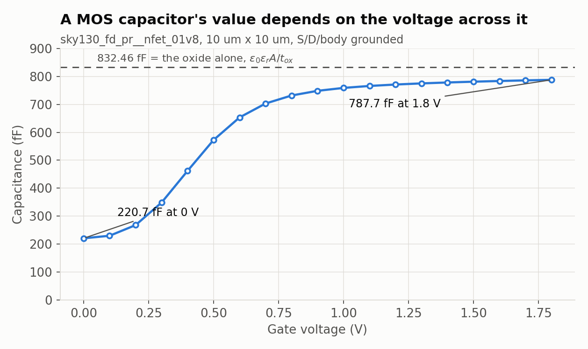

# A capacitor is a sandwich

**Question this page answers:** *There is no ceramic disc on a chip. So what is a
capacitor made of?*

A capacitor is embarrassingly simple: **two conductors that are near each other and
not touching.** That is the entire definition. Everything else — dielectric,
plates, packaging — is engineering around those eight words.

Put two flat plates of area $A$ a distance $d$ apart, with a material of relative
permittivity $\varepsilon_r$ between them:

$$C = \varepsilon_0 \varepsilon_r \frac{A}{d}$$

You already know this. What changes on a chip is that **you cannot choose $d$**. The
layer thicknesses were fixed by the foundry. The only free variable is $A$ — the
area you are willing to spend. So on a chip, capacitance is measured not in farads
but in **farads per square micrometre**, and the design question is always *how much
floor space am I buying?*

## The three sandwiches SKY130 will sell you

**1. MIM — Metal–Insulator–Metal.** A dedicated thin plate (`capm`) floated just
above met3, with a purpose-made thin dielectric between them. It exists for no
reason except to be a capacitor. The models are
`sky130_fd_pr__cap_mim_m3_1` (between met3 and met4) and `..._m3_2` (met4 to met5).

**2. MOS — a transistor used sideways.** Take an nFET, tie source, drain and body
all to ground, and use the gate as one plate against the channel underneath. The
dielectric is the gate oxide, which is the thinnest insulator on the entire chip —
so this is by far the densest capacitor available.

**3. VPP — Vertical Parallel Plate.** No special layer at all. Interleave ordinary
metal wires like the teeth of two combs and use the sidewall capacitance between
them. SKY130 ships about eighty pre-drawn VPP structures, named by their footprint:
`sky130_fd_pr__cap_vpp_11p5x11p7_l1m1m2m3m4_shieldm5` is 11.5 µm × 11.7 µm and uses
li plus met1 through met4, shielded by met5.

## Measure all three the same way

```bash
cd labs/passives-decks
make capacitor
```

Each device gets a 1 V AC source at 1 kHz; the current it draws gives
$C = \operatorname{Im}(I)/2\pi f$. No fitting, no formulas — the number the model
actually produces.

**What you should see:**

```
--- capacitance in farads ---
c_mim_1x1 = 2.642250e-15
c_mim_10x10 = 2.065822e-13
c_mim_30x30 = 1.819782e-12
c_vpp = 1.473400e-13
c_mos_1v8 = 7.876883e-13
c_mos_0v0 = 2.207182e-13
```

| construction | drawn size | capacitance | density |
|---|---|---:|---:|
| MIM | 1 × 1 µm | 2.64225 fF | 2.64 fF/µm² |
| MIM | 10 × 10 µm | 206.5822 fF | 2.07 fF/µm² |
| MIM | 30 × 30 µm | 1819.782 fF | 2.02 fF/µm² |
| VPP fringe | 11.5 × 11.7 µm | 147.3400 fF | 1.10 fF/µm² |
| MOS at 1.8 V | 10 × 10 µm gate | 787.6883 fF | 7.88 fF/µm² |
| MOS at 0 V | *the same device* | 220.7182 fF | 2.21 fF/µm² |

Two things in that table deserve a paragraph each.

## The MIM number closes exactly

The MIM model is not a black box — you can reproduce it to the last digit. Its
parameter file (`libs.tech/ngspice/r+c/res_typical__cap_typical__lin.spice`) says

```
+ camimc=  2.00e-15  ; Units: farad/micrometer^2
+ cpmimc = 0.19e-15 ; Units: farad/micrometer
```

2.00 fF per square micron of plate, plus 0.19 fF per micron of plate *perimeter*
(the field that bulges out the sides). And the model card itself corrects the drawn
size:

```
.param wc = 'w+m3_dw*1e6+tol_m3*1e6'
```

with `m3_dw = -0.025u`, so a plate you drew 30 µm across is manufactured **29.975 µm**
across. Now do the sum for the 30 × 30 device:

$$2.00 \times 29.975^2 \;+\; 0.19 \times 2 \times (29.975 + 29.975) = 1797.00125 + 22.781 = \boxed{1819.782\ \text{fF}}$$

ngspice printed `1.819782e-12`. Every digit.

Notice the perimeter term explains the density column: 2.64 fF/µm² for the 1 × 1
device, falling to 2.02 fF/µm² at 30 × 30. **Small capacitors are denser than big
ones**, because the edge is a larger fraction of them. It is the same shape of
effect as the contact heads on a short resistor, and it will not be the last time
you see it.

## The MOS number moves under your feet

Look again at the last two rows. Same transistor, same 100 µm² of gate. **787.6883 fF
with 1.8 V on the gate; 220.7182 fF with 0 V on it.** A factor of **3.57**, from a
component whose entire job is to have a value.

The C–V sweep in `spice/c_moscap_cv.spice` walks the gate from 0 V to 1.8 V in
100 mV steps:



- **Try this:** run `make capacitor` and read `c_000mv` through `c_180mv`.
- **What you should see:** 220.7182 fF at 0 V, a steep climb between 0.3 V and
  0.7 V, and a flattening toward 787.6883 fF that never quite reaches the dashed
  line.
- **Why an engineer cares:** the steep part is the threshold. Below it the gate is
  talking to a depleted, nearly empty channel — two plates far apart. Above it an
  inversion layer forms right under the oxide and the "plate" snaps into place a few
  nanometres away. That is a MOSFET turning on, seen from the capacitance side.
  You will meet it again in AD103 as the thing that sets a transistor's speed.

The dashed line is not fitted. The nFET model card
(`sky130_fd_pr__nfet_01v8__tt.pm3.spice`) gives the oxide thickness:

```
+ toxe = {4.148e-09 + ...}
```

4.148 nm. So the oxide capacitance per unit area is

$$C_{ox} = \frac{\varepsilon_0 \varepsilon_r}{t_{ox}} = \frac{8.854\times10^{-12} \times 3.9}{4.148\times10^{-9}} = 8.3247\ \text{fF/µm}^2$$

and over 100 µm² of gate that is **832.46 fF**. The simulation tops out at 787.6883,
which is 94.6 % of it — the missing 5 % is the inversion layer's own finite
capacitance sitting in series with the oxide. Close enough that you can trust
$C_{ox} A$ as your back-of-envelope MOS-cap density and be within 6 %.

## So which one do you use?

| | MIM | MOS | VPP |
|---|---|---|---|
| density | 2.0 fF/µm² | ~8 fF/µm² | ~1.1 fF/µm² |
| linear? | **yes** | no — 3.57× swing | yes |
| leaks? | no | yes, through 4 nm of oxide | no |
| costs extra masks? | yes | no | **no** |
| lives above the transistors? | yes | no | yes |

**MIM** when the value has to be a value — filters, references, anything where
"3.57× depending on the signal" is fatal. **MOS** when you need a lot of farads and
do not care about linearity: supply decoupling is the classic case, where the whole
job is to be a charge reservoir at a fixed voltage. **VPP** when you want a
capacitor and refuse to pay for the MIM masks, or when you want a *ratio* rather
than a value, since fringe structures match beautifully.

## Why an engineer cares

The word "capacitor" hides three completely different devices with different
failure modes. Picking the wrong one is not a performance bug, it is a
"my filter's corner frequency depends on the input signal" bug — and that class of
bug does not show up until you build it.

Next: [What a picofarad costs](guide/what-a-picofarad-costs.md), where the density
column above turns into floor plan.
