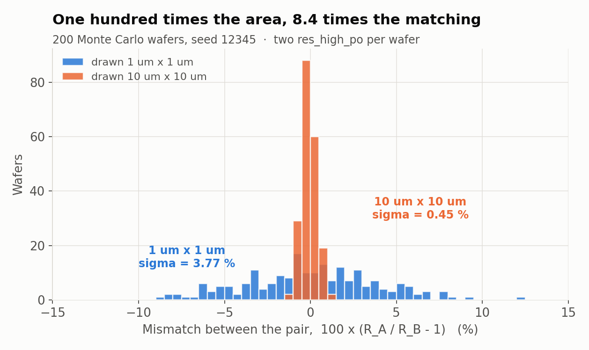

# Matching beats accuracy

**Question this page answers:** *If a chip cannot hold a resistor to better than
±12.5 %, how does anyone build a 12-bit converter?*

By never asking the chip for a value. Only ever asking it for a **ratio**.

This is the single most important idea in analog IC design, it is one line of
arithmetic, and it is almost never taught in a first circuits course — which is a
shame, because it explains most of what analog schematics look like.

## The demonstration

You already ran it. `make corners` prints, for each of the three process corners,
two resistors drawn 1:4 and the output of a divider made from them.

```
--- ll : absolute (moves) ---
r_a = 3.106637e+03
r_b = 1.143366e+04
--- ll : ratio and divider (do not move) ---
ratio = 3.680396e+00
divider = 3.845828e-01
```
```
--- tt : absolute (moves) ---
r_a = 3.550443e+03
r_b = 1.306704e+04
--- tt : ratio and divider (do not move) ---
ratio = 3.680396e+00
divider = 3.845828e-01
```
```
--- hh : absolute (moves) ---
r_a = 3.994248e+03
r_b = 1.470042e+04
--- hh : ratio and divider (do not move) ---
ratio = 3.680396e+00
divider = 3.845828e-01
```

Set it out in one table:

| | `ll` | `tt` | `hh` | spread |
|---|---:|---:|---:|---:|
| $R_A$ | 3106.637 Ω | 3550.443 Ω | 3994.248 Ω | **±12.5 %** |
| $R_B$ | 11 433.66 Ω | 13 067.04 Ω | 14 700.42 Ω | **±12.5 %** |
| $R_B / R_A$ | 3.680396 | 3.680396 | 3.680396 | **0** |
| divider out | 0.3845828 V | 0.3845828 V | 0.3845828 V | **0** |

Every printed digit of the ratio is identical. Every printed digit of the divider
output is identical. The two resistors swung by a quarter of their value between
those runs, and the circuit built from them did not move at all.

## Why it has to be true

The corner does not add an offset — it applies a **multiplier**. Every device made
of that material gets the same factor $k$:

$$\frac{R_B}{R_A} = \frac{k\,R_{\square}\,L_B/W}{k\,R_{\square}\,L_A/W} = \frac{L_B}{L_A}$$

$k$ cancels. So does $R_\square$. So does the width tolerance, if both resistors are
the same width. What survives is a **ratio of lengths you drew**, and lengths on a
mask are held to nanometres.

And that is why the ratio is 3.680396 rather than the 4.0 you drew. $L_B/L_A = 40/10 = 4$
for the *bodies*, but each device also carries 378.2448 Ω of ends
([Ohms per square](guide/ohms-per-square.md)):

$$\frac{R_B}{R_A} = \frac{378.2448 + 317.2198\times 40}{378.2448 + 317.2198\times 10} = \frac{13067.04}{3550.443} = 3.680397$$

ngspice printed `3.680396`. **The end resistance is a systematic ratio error and it
does not go away with the corner** — which is exactly why real layouts build a 4:1
ratio as *four identical unit resistors in series next to one*, not as one long
strip beside one short one. Four units in series have four sets of ends; one unit
has one; the ratio comes out 4.000000, and it comes out that way at every corner.

That is the first rule of matched layout, and you just derived it from a printed
number.

> **The reflex:** *if you need a ratio, build both sides out of the same unit
> device, repeated. Never out of one big one and one small one.*

## The part that does not cancel

Corners are global, so ratios beat them completely. Mismatch is local, and it does
not cancel at all — it is the floor.

```bash
cd labs/passives-decks
make mismatch
```

Two hundred Monte Carlo runs with `mc_mm_switch=1` and `setseed 12345`, so your
numbers are the numbers below. ([Lab
04](labs/lab-04-two-resistors-that-disagree-overview.md) runs the same experiment
from `setseed 1` and gets 2.5852 % for the 1 µm² device — a different draw from the
same distribution, not a different answer.) Four devices: **A** and **B** drawn 1 µm × 1 µm; **C**
and **D** drawn 10 µm × 10 µm — one hundred times the area, same recipe, same
foundry.

```
== 5/5  mismatch: 200 wafers, four resistors ==================
   800 measurements recorded

  Monte Carlo: 200 runs, seed 12345
  ok       sigma/mean A (1x1)       2.7930 %   (reference  2.7930 %)
  ok       sigma/mean B (1x1)       2.8775 %   (reference  2.8775 %)
  ok       sigma/mean C (10x10)     0.3045 %   (reference  0.3045 %)
  ok       sigma/mean D (10x10)     0.3479 %   (reference  0.3479 %)
  ok       sigma/mean A/B ratio     3.7695 %   (reference  3.7695 %)
  ok       sigma/mean C/D ratio     0.4496 %   (reference  0.4496 %)
           100x the area bought 8.38x better matching   (Pelgrom's square root of 100 would be 10x)
```



Two hundred wafers. On each one, two resistors that were drawn with the same
rectangle. The blue histogram is the 1 µm × 1 µm pair — routinely 5 % apart,
sometimes 12 %. The orange is the 10 µm × 10 µm pair, piled up within half a percent.

## Pelgrom's law, and the arithmetic closing

The rule behind that plot has a name. **Pelgrom's law**: the mismatch between two
identically drawn devices scales as one over the square root of their area.

$$\frac{\sigma_{\Delta R}}{R} = \frac{A_R}{\sqrt{W L}}$$

$A_R$ is a per-process constant. You do not have to take it on faith — SkyWater
prints it on the model card, in `sky130_fd_pr__res_high_po.model.spice`:

```
+ body_pelgrom = 0.03552
+ head_pelgrom = 0.0761
+ num_con_row = {max(floor(0.5+(w-0.33)/0.36),1)}
+ rbody_match = {body_pelgrom/sqrt(w*l*mult)*MC_MM_SWITCH*AGAUSS(0,1.0,1)}
+ rend_match  = {head_pelgrom/sqrt((w+0.525)*num_con_row*mult)*MC_MM_SWITCH*AGAUSS(0,1.0,1)}
```

The body matches as $0.03552/\sqrt{WL}$; the contact heads match as
$0.0761/\sqrt{(W+0.525)\,n_{\text{contacts}}}$ — a *different* law, because a
contact head is not an area, it is a row of cuts.

Now predict the Monte Carlo before you look at it. You measured the head and body of
both devices in `make resistor`:

```
head_l1 = 2.998915e+02    body_l1 = 3.955731e+02    r_l1 = 6.954646e+02
head_10x10 = 3.410354e+01 body_10x10 = 3.247625e+02 r_10x10 = 3.588661e+02
```

**The 1 µm × 1 µm device.** $n_{\text{contacts}} = \lfloor 0.5 + (1-0.33)/0.36 \rfloor = 2$.

$$\sigma_{\text{head}} = \frac{0.0761}{\sqrt{1.525 \times 2}} = 4.357\ \% \qquad \sigma_{\text{body}} = \frac{0.03552}{\sqrt{1}} = 3.552\ \%$$

$$\sigma_R = \sqrt{(299.8915 \times 0.04357)^2 + (395.5731 \times 0.03552)^2} = \sqrt{13.067^2 + 14.051^2} = 19.188\ \Omega$$

$$\frac{\sigma_R}{R} = \frac{19.188}{695.4646} = \boxed{2.759\ \%}$$

Monte Carlo says **2.7930 %** and **2.8775 %**. Two hundred samples pin σ down to
about $1/\sqrt{2N} = 5\ \%$ of itself, so 2.759 and 2.79 are the same number.

**The 10 µm × 10 µm device.** $n_{\text{contacts}} = \lfloor 0.5 + 9.67/0.36 \rfloor = 27$.

$$\sigma_{\text{head}} = \frac{0.0761}{\sqrt{10.525 \times 27}} = 0.4514\ \% \qquad \sigma_{\text{body}} = \frac{0.03552}{\sqrt{100}} = 0.3552\ \%$$

$$\sigma_R = \sqrt{(34.10354 \times 0.004514)^2 + (324.7625 \times 0.003552)^2} = 1.1638\ \Omega$$

$$\frac{\sigma_R}{R} = \frac{1.1638}{358.8661} = \boxed{0.3243\ \%}$$

Monte Carlo says **0.3045 %** and **0.3479 %**.

Predicted improvement: $2.759 / 0.3243 = 8.51\times$. Measured: **8.38×**.

**And notice it is not 10.** Pelgrom's $\sqrt{100} = 10$ is what you get if the whole
device is body. It is not — 43 % of the small resistor is contact head, and heads
match as $\sqrt{(W+0.525)\,n}$, which grew by only 9.7× rather than 100×. The
shortfall from 10 to 8.4 *is* the contact heads, and if you had predicted 10× you
would have been wrong in a way the model can explain to you.

## The whole of analog layout, in four rules

Everything above collapses into practice:

1. **Build ratios out of identical unit devices.** A 4:1 ratio is four units and one
   unit, never a long one and a short one. It kills the end-resistance error and it
   makes both sides see the same etch.
2. **Buy matching with area.** Need 0.1 % matching? $\sigma = A_R/\sqrt{WL}$ says
   $WL \approx (0.03552/0.001)^2 = 1262$ µm² per device. Matching is not free and
   the price is quoted in square micrometres.
3. **Surround the array with dummies.** The outermost real unit has a neighbour on
   one side and empty space on the other; etch and stress do not care that the empty
   side was not part of your plan. A sacrificial unit connected to nothing makes
   every real unit's surroundings identical.
4. **Interdigitate, or use a common centroid.** If the wafer has a gradient across
   it — and it does, in temperature, in oxide thickness, in stress — then two devices
   placed side by side sit at different points on that gradient. Splitting each into
   halves and laying them out `A B B A` puts both devices' *centres of mass* at the
   same point, so a linear gradient cancels exactly.

Rules 3 and 4 are drawings, not equations, which is why they belong to
[AD104](https://uoftasic.com/ad104/). But the reason for them is on this page.

## Why an engineer cares

Go back to the question at the top. A 12-bit ADC needs 1-part-in-4096 accuracy from
a process that cannot hold a resistor to one part in eight. It gets there because
its accuracy never depends on a value:

- a **capacitor DAC** is a binary-weighted array of *identical unit capacitors* — its
  linearity is a ratio, and the unit is made large enough that Pelgrom gives the
  required $\sigma$;
- a **current mirror** copies a current by making two transistors identical, not by
  knowing what the current is;
- a **bandgap reference** produces a voltage from a *resistor ratio* times
  $kT/q$ — a physical constant — so the absolute sheet resistance drops out;
- a **differential pair**, the fundamental analog building block, cares only that
  its two halves are the same, and not at all what they are.

Every one of those is the same move. **Do not ask silicon for a number. Ask it for a
copy.** Silicon is superb at copies and hopeless at numbers, and once you have seen
`3.680396` printed three times you cannot unsee it.

## Where this goes next

Next: [From schematic to cross-section](guide/from-schematic-to-cross-section.md), the AD102
capstone. Everything so far has been a plan view — a rectangle on a mask layer. That page turns
the chip on its side, reads the real layer thicknesses out of the PDK, and finishes the
arithmetic this course opened with: your measured **317.2198 Ω/□**, times a thickness you can
look up, is a resistivity. It ends in a floor-plan exercise with no package and no marking
scheme.

After that, you now know what the passive elements *are* on a chip, what they cost, and which of
their properties you are allowed to depend on. Two doors open from here:

- **[AD103 — Nonlinear Circuits](https://uoftasic.com/ad103/)** takes the same
  question — *what is this component, physically?* — to the diode and the MOSFET,
  where the answer stops being linear and the C–V curve you plotted on
  [A capacitor is a sandwich](guide/a-capacitor-is-a-sandwich.md) turns out to be a
  transistor turning on.
- **[AD104 — Layout](https://uoftasic.com/ad104/)** makes you draw rules 3 and 4 in
  Magic and prove them with DRC and LVS.

Before either, do [Lab 04 — Two resistors that
disagree](labs/lab-04-two-resistors-that-disagree-overview.md). It runs its own
Monte Carlo, verifies Pelgrom's law across four device sizes, and ends by making you
hit a divider specification that a naive two-resistor layout cannot meet.

Stuck on anything here? The team Discord is at <https://discord.gg/hrJnP5UsGz>.
