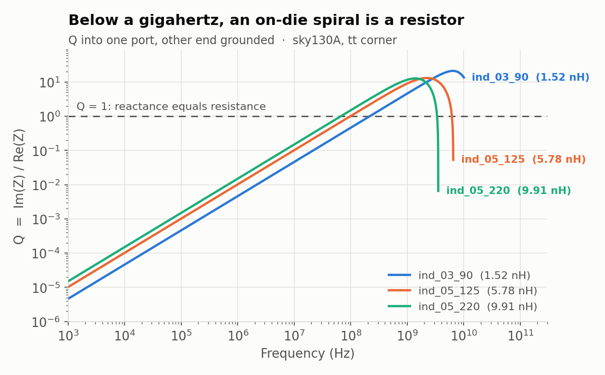
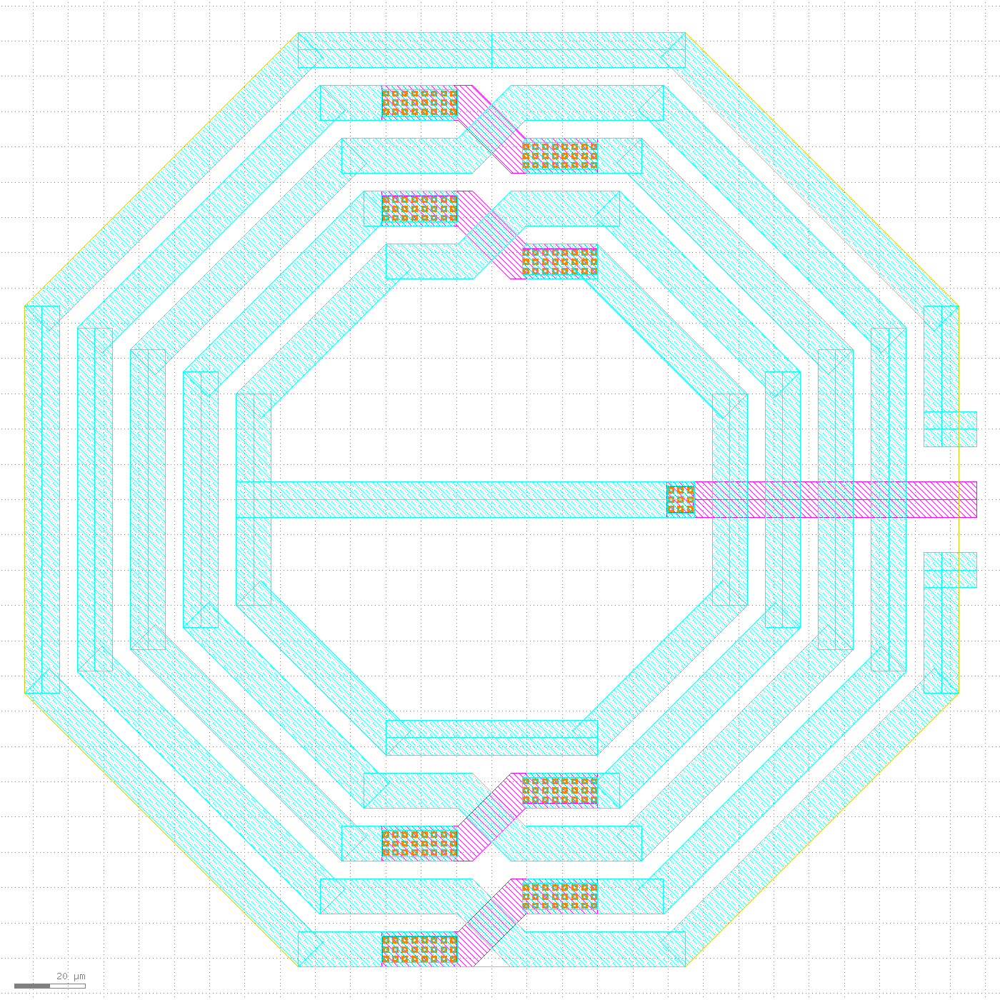
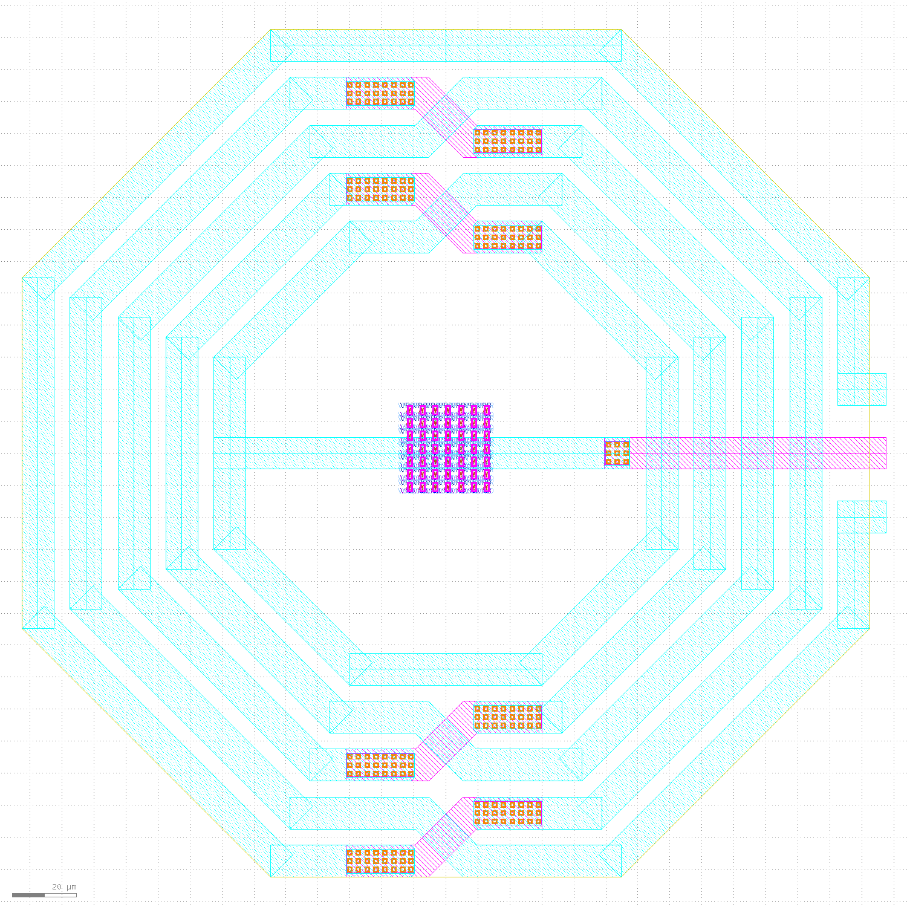

# The inductor problem

**Question this page answers:** *Resistors and capacitors both turned out to be
drawings. Surely an inductor is just a spiral — so why does nobody use one?*

Because it does not work, and it is enormous, and those two facts are the same fact.

This is the most surprising page in AD102. Everything you have been told about
passives on a chip so far has been "it's a shape, and the shape costs area."
Inductors break the pattern: you can draw one, the foundry will make it, and the
thing you get back is **a resistor**.

## Start with what the PDK ships

SKY130 models exactly three spiral inductors. They live in
`libs.ref/sky130_fd_pr/spice/` and, unlike everything else in this course, they are
**not** included by `sky130.lib.spice` — you have to `.include` them yourself:

```
sky130_fd_pr__ind_03_90.model.spice
sky130_fd_pr__ind_05_125.model.spice
sky130_fd_pr__ind_05_220.model.spice
```

> **Name the error before you cause it.** Forget the `.include` and ngspice says
>
> ```
> Error: unknown subckt: x1 a 0 ct 0 sky130_fd_pr__ind_05_220
>     Simulation interrupted due to error!
> Error: incomplete or empty netlist
> ```
>
> That is not a broken PDK. That is a file you did not include.

Open one. `sky130_fd_pr__ind_05_220.model.spice` is thirteen lines and every one of
them is worth reading:

```
.subckt  sky130_fd_pr__ind_05_220 a b ct sub
R31 net27 b r='1e-2'
R26 a net23 r='1e-2'
C2 net27 net31 c='223.7e-15'
C24 net35 net27 c='205e-15'
C25 net23 net37 c='223.7e-15'
R5 sub net31 r='5.358e3'
R4 net41 net27 r='2.059'
R13 net23 net35 r='9.064'
R10 sub net37 r='5.358e3'
R9 net23 net39 r='2.059'
    L1 net39 ct l=4.96e-9
    L3 ct net41 l=4.96e-9
.ends
```

Two inductors of 4.96 nH — one either side of the centre tap `ct` — for **9.92 nH
total**. And wrapped around them: **4.138 Ω of series resistance** (2.059 + 2.059 +
0.01 + 0.01); **447.4 fF coupling into the substrate** — two 223.7 fF capacitors,
each draining through 5.358 kΩ into the `sub` terminal; **205 fF** straight across
the winding; and a 9.064 Ω resistor modelling loss in the silicon underneath.

The inductance is two lines out of thirteen. The other eleven lines are the problem.

## Q, and the number that ends the argument

The figure of merit for an inductor is

$$Q = \frac{\operatorname{Im}(Z)}{\operatorname{Re}(Z)} \approx \frac{\omega L}{R_{s}}$$

An ideal inductor has $Q = \infty$. A resistor has $Q = 0$. Q says *what fraction of
this component is actually an inductor.*

```bash
cd labs/passives-decks
make inductor
```

**What you should see:**

```
--- ind_05_220: L (H), Q, series R (ohm) at four frequencies ---
l_1khz              =  9.91271e-09
q_1khz              =  1.50516e-05
r_1khz              =  4.13800e+00
l_1mhz              =  9.91271e-09
q_1mhz              =  1.50516e-02
l_100mhz            =  9.92203e-09
q_100mhz            =  1.50196e+00
l_1ghz              =  1.07762e-08
q_1ghz              =  1.16534e+01
```

**At 1 kHz, Q is 0.0000150516.**

Read that again. At audio frequency, the largest inductor SKY130 offers is
99.9985 % resistor. It is not a poor inductor; it is a 4.138 Ω resistor with a
rounding error of magnetism attached. Nothing you can do in the circuit changes
that, because $Q = \omega L/R$ and $\omega$ is not yours to choose.



The line is straight on log–log because Q is proportional to frequency: every decade
you climb multiplies Q by ten. That is why on-die inductors exist *at all* — at
2.4 GHz they are genuinely useful, and every Wi-Fi and Bluetooth radio ever
fabricated has spirals in its LC oscillator. Below about 100 MHz they are furniture.

```
--- best Q each spiral ever reaches, and where ---
qpeak_03_90         =  2.11268e+01 at=  6.38263e+09
qpeak_05_125        =  1.30871e+01 at=  2.21309e+09
qpeak_05_220        =  1.27198e+01 at=  1.38835e+09
```

The best any of them ever manages is **Q = 21.1**, and only at 6.38 GHz. Compare
that to the resistor you have been simulating all course, whose *value* you can hit
to five digits.

## And then it stops being an inductor entirely

Those 223.7 fF capacitors in the netlist do not just sit there. They resonate with
the inductance, and above that frequency the whole structure behaves like a
capacitor:

```
--- self-resonance: the frequency where it stops being an inductor ---
srf_05_125          =  6.49382e+09 with=  1.99663e+03
srf_05_220          =  3.52777e+09 with=  2.18171e+03
```

(`meas ac` prints the value it was searching on as well; the frequency is the first
number.)

**3.52777 GHz.** Above it, `ind_05_220` is not a slightly worse inductor — its
reactance has changed sign. On the Q plot you can see all three curves fall off a
cliff. Between 100 MHz (Q = 1.50) and 3.53 GHz (dead) there is barely a decade and a
half of usable band, and the peak is 12.7.

## Now the area

Here is where the surprise becomes visceral. The `ind_*` files are electrical models
with no layout attached, but SKY130 does ship drawn spirals: three RF test coils
inside `libs.ref/sky130_fd_pr/gds/sky130_fd_pr.gds`. (They are separate PDK objects
from the three models — different names, different characterisation — but they are
the same kind of structure, and they are the only on-die inductors this process has
ever drawn.) Their bounding boxes, measured with KLayout:

| cell | footprint | area |
|---|---|---:|
| `sky130_fd_pr__rf_test_coil1` | 150.020 × 145.040 µm | 21 758.9 µm² |
| `sky130_fd_pr__rf_test_coil2` | 270.000 × 265.000 µm | 71 550.0 µm² |
| `sky130_fd_pr__rf_test_coil3` | 370.080 × 365.080 µm | 135 108.8 µm² |

Here is the middle one, rendered from that GDS with the SKY130 KLayout layer
properties:



Concentric octagonal turns of met3 (cyan, 32 806.81 µm² of it), with met2
crossunders (magenta) where the winding has to jump over itself, and **201 arrays of
via2** joining the two layers so the two metals carry the current in parallel. The
bar running out through the middle is the third terminal — the same centre tap the
netlist calls `ct`. The whole thing sits inside a marker on a layer literally named
`inductor.drawing` (GDS 82/24), because the foundry's tools need to know not to put
anything underneath it.

Now the same picture with forty-nine `sky130_fd_sc_hd__inv_1` standard cells dropped
in the middle, at the same scale:



You can barely see them. `inv_1` is 3.7536 µm²; the coil is 71 550 µm². **One
inductor is 19 062 inverters** — a small CPU's worth of silicon, for single-digit
nanohenries and a Q in the low teens, in a band you probably were not using.

## Why it is bad, in one paragraph of physics

An inductor stores energy in a magnetic field in the space around the wire. A
capacitor stores it in an electric field in a gap you can make 4 nanometres thick;
a resistor is a strip whose length you control. But magnetic field has no thin-film
equivalent — to get inductance you need *area enclosed by current*, and the only way
to buy that is with actual square micrometres. Worse, the field goes straight down
into the silicon substrate, which is a conductor, so it induces eddy currents that
show up as the 9.064 Ω and 5.358 kΩ resistors in the model. **You cannot make an
inductor small, and you cannot stop it talking to the wafer it is printed on.**

This is why bond wires and package traces are sometimes used as the inductor
instead: a 1 mm bond wire is roughly a nanohenry, it is in the package rather than
on the die, and it costs no silicon at all.

## The reflex to keep

> **If your circuit needs an inductor below a gigahertz, the circuit is wrong for a
> chip.** Not the layout. The circuit.

There is no layout trick, no clever fold, no better metal stack that fixes
$Q = 1.5\times10^{-5}$ at 1 kHz. The response is to change the topology — and
because analog designers have been living with this constraint since the 1960s,
there is a mature and rather beautiful set of replacements.

Next: [What analog builds instead](guide/what-analog-builds-instead.md).
