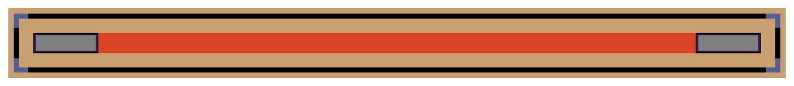
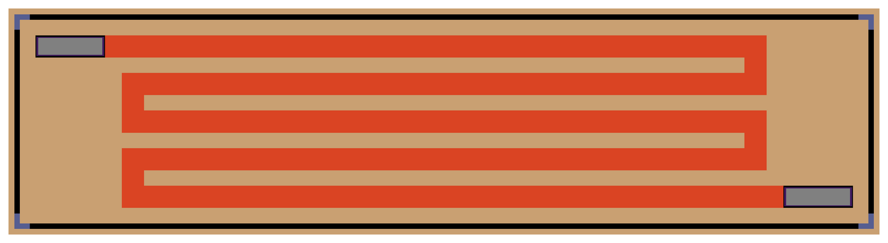

# What a value costs in area

**Question this page answers:** *If a resistance is just a length, how long is a
real one — and is that a problem?*

You have the equation. For `sky130_fd_pr__res_high_po` drawn 1 µm wide:

$$R(L) = 378.2448 + 317.2198\,L \qquad (L \text{ in µm})$$

Turn it around and you have a design procedure. Want $R$? Draw

$$L = \frac{R - 378.2448}{317.2198}$$

## Three values, sized and simulated

| you want | $L$ from the formula | ngspice says |
|---:|---:|---:|
| 1 kΩ | 1.960036 µm | 1000.007 Ω |
| 10 kΩ | 30.331608 µm | 10 000.03 Ω |
| 100 kΩ | 314.046454 µm | 100 000.0 Ω |

```
--- B. sized to 1 k, 10 k, 100 k (ohms) ---
r_1k = 1.000007e+03
r_10k = 1.000003e+04
r_100k = 1.000000e+05
```

Stop on the last row. **100 kΩ is a strip of poly-silicon 314 micrometres long.**

For scale: the smallest inverter in the SKY130 standard-cell library,
`sky130_fd_sc_hd__inv_1`, has `area : 3.7536` µm² in
`libs.ref/sky130_fd_sc_hd/lib/sky130_fd_sc_hd__tt_025C_1v80.lib`. Your 100 kΩ, at
314.046454 × 1 µm = 314.05 µm² of drawn poly, occupies the silicon of **84
inverters**. One passive component you would not think twice about on a breadboard
costs as much floor space as a small logic block.

And it gets worse quickly. A 1 MΩ resistor in the same material and the same width
needs

$$L = \frac{10^6 - 378.2448}{317.2198} = 3151.6\ \text{µm} = 3.15\ \text{mm}$$

which is longer than many whole dies. That is not a resistor you fold; that is a
resistor you redesign the circuit to avoid.

## Width is the expensive axis

Here is the fact that decides how every on-chip resistor gets drawn. Rearranging,

$$L \propto R\,W \quad\Longrightarrow\quad \text{area} = W L \propto R\,W^2$$

**Area goes as the square of the width.** Draw it twice as wide for the same
resistance and you pay four times the silicon. Section D of the deck builds the
*same* 100 kΩ four times over, at four widths:

```
--- D. 100 k at four widths (ohms), and the area each one costs ---
r_w0p35 = 9.999975e+04
r_w0p69 = 1.000002e+05
r_w2 = 9.999982e+04
r_w5 = 1.000004e+05
```

| $W$ (µm) | $L$ (µm) | ngspice (Ω) | area $WL$ (µm²) | in `inv_1`s |
|---:|---:|---:|---:|---:|
| 0.35 | 101.9319 | 99 999.75 | **35.68** | 9.5 |
| 0.69 | 216.2792 | 100 000.2 | 149.23 | 39.8 |
| 1 | 314.046454 | 100 000.0 | 314.05 | 83.7 |
| 2 | 629.5313 | 99 999.82 | 1 259.06 | 335.4 |
| 5 | 1576.1560 | 100 000.4 | 7 880.78 | 2 099.5 |

Same value, to five digits, at every row. **221 times the area** between the top row
and the bottom. $(5/0.35)^2 = 204$, and the rest is the fixed end resistance
shrinking the required length slightly at the wide end — the square law with a small
correction, exactly as the algebra says.

**The reflex:** *draw a resistor at the narrowest width the rules and your accuracy
budget allow.* 0.35 µm is the narrowest `res_high_po` SKY130 permits. Widening is
something you do deliberately, to buy matching ([Matching beats
accuracy](guide/matching-beats-accuracy.md)) or to carry current — never by
accident.

## The other lever: change the recipe

Width and length are yours. The material is a menu. Same 314.046454 × 1 µm strip,
four implants, from section C:

| model | value | Ω/□ (measured) |
|---|---:|---:|
| `res_generic_nd` (n+ diffusion) | 36.89775 kΩ | 120 |
| `res_generic_pd` (p+ diffusion) | 61.38915 kΩ | 197 |
| `res_high_po` | 100.0000 kΩ | 317.2198 |
| `res_xhigh_po` | 665.3872 kΩ | 2118.7619 |

`res_xhigh_po` is 6.7× denser in ohms per micron. That 1 MΩ monster shrinks from
3.15 mm to

$$L = \frac{10^6 - 34.2111}{2118.7619} = 472.0\ \text{µm}$$

Still big — 472 µm² of poly at a 1 µm width, 126 inverters. But it fits on a die.

> **Where 2118.7619 comes from, and why it isn't 2000.** The `res_xhigh_po` model
> card says `rsheet = 2000.0`, flatly. It also says
> `weff = {w-0.056}` — the strip comes out of the fab **56 nm narrower than you drew
> it**, because the etch undercuts the edge. So at a drawn W = 1 µm the material is
> really 0.944 µm wide, and the resistance per micron of length is
> $2000 / 0.944 = 2118.6441\ \Omega$. [Lab
> 01](labs/lab-01-a-resistor-you-designed-overview.md) measures **2118.7619**. The
> arithmetic closes to five digits, and the leftover is the model's small
> nonlinear body term. Hold on to this one: it is the first time in this course that
> *what you drew* and *what you got* are provably different numbers, and
> [Movement IV](guide/the-value-you-drew-is-not-what-you-get.md) is entirely about
> that gap.

## Nobody draws a 314 µm rectangle

A 314 µm × 1 µm strip does not fit anywhere sensible, so real layouts **fold** it —
draw it as, say, sixteen strips of 20 µm side by side, joined end to end by little
metal straps, like the boustrophedon of a ploughed field. The electrical answer is
the same (squares are squares, and a corner is roughly half a square), but you now
pay for:

- the metal straps and the contacts at every turn,
- the mandated spacing between adjacent poly strips,
- a guard ring, if the resistor needs isolating from its neighbours,
- and **dummy strips** at each end — sacrificial resistors, connected to nothing,
  whose only job is to make the outermost real strip see the same neighbourhood as
  the inner ones. Etching behaves differently at the edge of a pattern than in the
  middle of one, and a dummy is how you make that difference land on a device
  nobody uses.

Drawn straight, a resistor is the rectangle the formula literally describes — a bar
of poly with one contact at each end:



Folded, it is the same bar walked back and forth, with a strap carrying the current
around each turn:



*Three passes here, not the sixteen the 100 kΩ above would need — the shape is the
point, not the count.* The red is the resistor body, the grey blocks at the ends are
its contacts. Every turn you add buys you height and costs you two corners.

A folded 100 kΩ with guard ring and dummies typically occupies **two to three times**
its 314 µm² of drawn poly. Nobody publishes an exact multiplier, because it depends
on the fold count and the spacing rules — which is precisely why AD104 makes you
draw one.

## See the layers, not the netlist

For an unhurried look at what "a strip of poly with two contacts" actually is, open
**SiliWiz** — a browser layout toy from the Tiny Tapeout project that shows a
cross-section of your drawing while you draw it:

**<https://app.siliwiz.com/?preset=blank>**

1. Pick the **polyres** layer from the palette on the left and draw a long thin
   rectangle.
2. Pick **metal1 via** and drop one square at each end of it.
3. Pick **metal1** and put a contact pad over each via.
4. Click each metal1 pad, choose **Set Label** (or press `S`), and name them `in`
   and `out`.
5. Tick **Show SPICE** at the bottom. Find the line starting `R0 in out` — that is
   your resistance.
6. Watch the **cross-section** view as you drag the rectangle longer and thinner.

There is a guided version of exactly this at
<https://tinytapeout.com/siliwiz/resistors/>.

> **SiliWiz is not SKY130, and its numbers are not the numbers on this page.** Its
> `polyres` layer is documented as *"400 ohms per square"*. SKY130's `res_high_po`
> is 317.2198 Ω/□ measured, 319.8 Ω/□ in the Magic tables. SiliWiz is a *picture* of
> how a resistor is made — an excellent one — with round numbers chosen for
> teaching. Use it for the cross-section. Use ngspice for the value.

## Why an engineer cares

Every analog block you will ever read about is shaped by this page. Bias networks
use ratios of small resistors instead of one big one. Bandgap references use a
handful of matched units rather than an exact value. Filters that would want a
megohm on a breadboard get built out of switched capacitors instead
([What analog builds instead](guide/what-analog-builds-instead.md)). None of that is
tradition — it is the consequence of 100 kΩ costing 84 inverters.

Next: [A capacitor is a sandwich](guide/a-capacitor-is-a-sandwich.md), where the
same question — *what is it, physically?* — has a much shorter answer and a much
more painful area bill.
