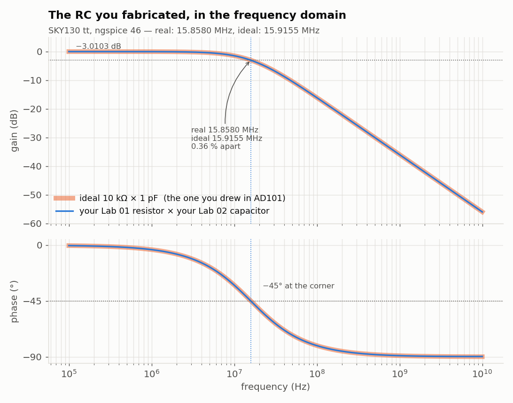
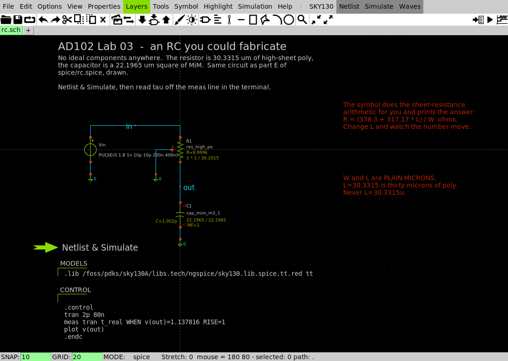
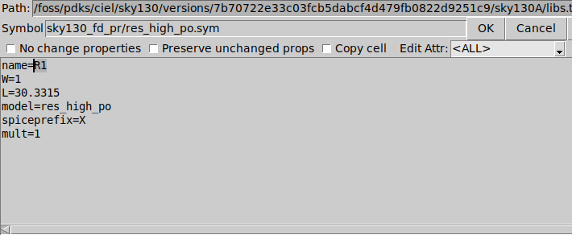

# Lab 03 — A time constant in silicon

Full runnable package: [`labs/lab-03-a-time-constant-in-silicon/`](https://github.com/uoftasic/ad102/tree/main/labs/lab-03-a-time-constant-in-silicon).

**Question this lab answers:** *I designed a resistor and I designed a
capacitor. Do they still make $\tau = RC$ when I put them together?*

## Prerequisites

- [Lab 01 — A resistor you designed](labs/lab-01-a-resistor-you-designed-overview.md)
- [Lab 02 — How big is a picofarad?](labs/lab-02-how-big-is-a-picofarad-overview.md)
- You are in `labs/lab-03-a-time-constant-in-silicon/`

## Objectives

- Measure a time constant from a transient simulation and know exactly what
  the number means
- Separate a measurement artefact from a device effect, on a five-picosecond
  discrepancy
- Say what a time constant costs in silicon, and find the cheapest split
  between $R$ and $C$ for a target $\tau$
- Explain why a chip counts clock ticks instead of charging a capacitor

## Theory (short)

A resistor charging a capacitor from a step:

$$v(t) = V_f\left(1 - e^{-t/RC}\right) \qquad \tau = RC$$

At $t = \tau$ the output has covered $1 - e^{-1} = 0.632120$ of its journey.
That is the whole measurement: step the input, find the moment the output
crosses 63.2 % of its final value, and that time *is* $\tau$, by definition.
Every `meas` in this lab is one line of exactly that.

For the divider in part A the capacitor does not see 1 kΩ — it sees the
Thevenin resistance $1\text{k} \parallel 2\text{k} = 666.67\ \Omega$, and
charges toward $1.8 \times \tfrac{2}{3} = 1.2$ V.

## Procedure

```bash
cd labs/lab-03-a-time-constant-in-silicon
make
```

Two ngspice runs, about **two and a half minutes**.

### Step 1 — the circuit you already know, and a five-picosecond mystery

Part A of `spice/rc.spice` is
[ECE334](https://uoftasic.com/ece334-docs/)'s lab-1 RC deck, unchanged.
Part B is an ideal 10 kΩ and an ideal 1 pF, so $\tau$ is 10 ns by
construction.

- **Try this:** predict both, then read the raw `meas` output — not the
  verdict table, the raw numbers.
- **What you should see:**

  ```
  t_ece334            =  1.47167e-09
  t_ideal             =  1.10050e-08
  v_ece334            =  1.20000e+00
  ```

  The final value is 1.2000 V, exactly as Thevenin says. But the step happened
  at $t = 1$ ns, so the ECE334 circuit took **471.67 ps** against a predicted
  466.67, and the ideal RC took **10.0050 ns** against a predicted 10.0000.

  Both are **five picoseconds** late. Not 1 % late — five picoseconds, the
  same five picoseconds, on two circuits whose time constants differ by a
  factor of twenty-one.

- **Why an engineer cares:** an error that does not scale with the thing being
  measured is not a property of the thing being measured. Look at the source:

  ```
  Va ai 0 PULSE(0 1.8 1n 10p 10p 200n 400n)
  ```

  The rise time is **10 ps**. Your step is a ramp, and a first-order system
  responds as though the step arrived at the ramp's midpoint. Half of 10 ps is
  5 ps. `check_rc.py` subtracts 1.005 ns and both circuits then read exactly:

  ```
  A  ECE334 deck: 1k/2k divider + 0.7 pF, ideal         466.6700 ps    466.6700 ps
  B  ideal 10 kohm + ideal 1 pF                          10.0000 ns     10.0000 ns
  ```

  Telling a **measurement artefact** apart from a **device effect** is most of
  what analog verification is. The tell was that it did not scale.

### Step 2 — take the ideal components away, one at a time

Parts C, D and E replace the ideal 10 kΩ with your Lab 01 resistor
($L = 30.3315$ µm), then the ideal 1 pF with your Lab 02 capacitor
($s = 22.1965$ µm), then both.

- **Try this:** predict all three before running. You designed both devices to
  hit their targets to better than one part in ten thousand, so you should
  predict 10.0000 ns three times.
- **What you should see:**

  ```
  C  YOUR Lab 01 resistor + ideal 1 pF                   10.0361 ns
  D  ideal 10 kohm + YOUR Lab 02 capacitor               10.0000 ns
  E  both of yours, no ideal parts anywhere              10.0362 ns
  ```

  The capacitor is invisible — swapping a real MIM plate for an ideal 1 pF
  changes nothing to five figures. The resistor is not: it adds **36.1 ps**,
  and it adds the same 36.1 ps whether the capacitor beside it is real or not.

- **Why an engineer cares:** part H of the deck measures where the 36 ps came
  from. Hang each resistor's far end in mid-air and ask what current the
  source still has to supply:

  ```
  --- H. the resistor's own capacitance to substrate (farads) ---
  cpar_10k = 7.233642e-15
  cpar_1m = 9.527787e-14
  ```

  **A 30 µm strip of poly is a 7.2 fF capacitor**, whether you wanted one or
  not. For a distributed RC line half of that adds to the time constant:
  $10\,\text{k}\Omega \times 7.234\,\text{fF}/2 = 36.2$ ps, against the
  **36.1 ps** you measured. Fitting both strips gives **0.1994 fF per
  micrometre** of 1 µm-wide poly plus 1.187 fF of ends — a number you will use
  in Step 5.

  Your resistor is a capacitor. It always was. Below some size you can ignore
  that, and this lab is about finding where that stops being true.

### Step 3 — the same circuit, designed by someone who skipped Labs 01 and 02

Part F sizes the identical circuit with the two naive rules: length straight
off the sheet resistance, area straight off the capacitance density.

- **What you should see:**

  ```
  F  the same circuit sized without Labs 01 and 02       10.5647 ns

  designing with Labs 01 and 02 : +0.36 % from the 10.0000 ns you asked for
  designing without them        : +5.65 %
  ```

- **Why an engineer cares:** Lab 01's end resistance was worth 3.7 % and Lab
  02's fringe was worth 1.5 %, and here they are in the same circuit,
  compounding into 5.65 % of timing error. Neither shows up as a warning,
  neither shows up in a DRC, and neither averages out across a wafer — every
  chip gets the same 5.65 %. That is the difference between a **tolerance**,
  which you budget for, and a **mistake**, which you do not know about.

### Step 4 — and now heat it up

The deck runs part E again at −40 °C and +125 °C. Nothing about the layout
changes.

- **Try this:** before looking, predict the direction. Lab 01's
  `solutions/README.md` told you `res_high_po` has `tc1 = 0.514e-3`.
- **What you should see:**

  ```
     E again at -40 C                                     9.7849 ns
     E again at +125 C                                   10.6544 ns

  and the SAME silicon over -40 C to +125 C spans 8.66 %
  ```

- **Why an engineer cares:** you spent this whole lab chasing a 5.65 % sizing
  error, and temperature alone is worth **8.66 %** across an industrial range.
  The MIM capacitor contributes almost none of it — its model card has
  `tc1 = 0` — so essentially all of the drift is the resistor. An on-chip RC
  is a fine way to make a filter corner you can afford to have wander, and a
  terrible way to make a clock.

### Step 5 — the price of a microsecond

Parts G and H build 1 µs twice: an ideal 1 MΩ against a real one — 471.98 µm
of `res_xhigh_po`, sized with your Lab 01 numbers.

- **Try this:** using the 0.1994 fF per µm from Step 2, predict the error
  before you run it.
- **What you should see:**

  ```
  G  ideal 1 Mohm + ideal 1 pF                          999.9950 ns
  H  real 1 Mohm of xhigh poly + your 1 pF             1049.9550 ns

  the microsecond ran 49.96 ns long.
    a 471.98 um strip of poly carries 95.278 fF to the substrate, and half of it
    adds to the time constant: R*Cpar/2 = 47.64 ns, which is 95 % of what you measured.
  ```

  **Five percent long, and no capacitor was mis-sized.** The strip that makes
  the megohm carries 95 fF of its own, which is a tenth of the capacitor it is
  charging.

- **Why an engineer cares:** scale it once more. A millisecond needs a
  thousand times this $RC$ — say 100 MΩ and 10 pF. At 1 µm wide, 100 MΩ of
  `res_xhigh_po` is **47,197 µm of poly**: 4.7 centimetres, folded into a
  serpentine, carrying about **9.4 pF** to the substrate all by itself. The
  resistor is now the same size as the capacitor it was supposed to charge,
  and there is no value of either that fixes it.

  **You cannot build a millisecond out of an RC on a chip.** Not expensively —
  at all. What chips do instead is *count*: an oscillator makes a short,
  repeatable interval and a digital counter multiplies it. That is why
  [DD103](https://uoftasic.com/dd103/)'s elevator controller measures its door
  dwell in clock ticks. It is one of the cleanest examples anywhere of a
  digital answer to an analog question, and this is the measurement that
  explains why the question was asked.

### Step 6 — your turn

`spice/my_rc.spice` has one resistor length and one capacitor side. Build a
**20.0 ns** time constant, within 1 %, in **under 400 µm²** of drawn area.

It ships with 2 kΩ and 10 pF, which is a fine 20 ns and costs 4981.84 µm² —
twelve times the budget. Your first `make` fails on area, not on timing:

```
  resistor  L =   5.1124 um at W = 1 um   ->       5.11 um^2
  capacitor s =  70.5459 um square       ->    4976.72 um^2
  total drawn area                         ->    4981.84 um^2   (budget 400)   FAIL
  tau = 20.0020 ns   target 20.0000 ns   (+0.01 %)   PASS
```

You have both sizing formulas already:

$$R = 378.2448 + 317.2198\,L \qquad
C[\text{fF}] = 2.000000\,s^2 + 0.659991\,s - 0.017742$$

and area is $L + s^2$. Push in the right direction and you will find the
optimum — and then you will find the thing that stops you going further, which
is the same 0.1994 fF per micrometre you measured in Step 2. When the
capacitor gets small enough, the resistor's own parasitic is a visible
fraction of it and $\tau$ runs long. Shrink the intended capacitor to pay for
it.

### Step 7 — the same RC, in the frequency domain

Everything so far has been a stopwatch: step the input, time the output. AD101
taught you the other way of asking — wiggle the input at every frequency and
plot where the output stops keeping up. Same circuit, same physics, different
question, and the two answers are locked together:

$$f_{-3\text{dB}} = \frac{1}{2\pi\tau}$$

```bash
make bode
```

About **two seconds** — this deck uses the pre-flattened `tt` library, which it
is allowed to because it needs no other corner and no mismatch. (See
[ngspice decks that actually run](reference/ngspice-decks-that-run.md) for when
you may and may not do that.)

- **Try this:** before you run it, take your $\tau$ from Step 2 — **10.0362 ns**
  — and predict the corner frequency.
- **What you should see:**

  ```
  f3db_real           =  1.58580e+07
  f3db_ideal          =  1.59155e+07
  ph_real             =  -7.85359e-01
  --- decade of roll-off: the real filter, dB at 10x the corner ---
  g_10x               =  -2.00426e+01
    wrote results/ad102-rc-bode.png
  ```

  That PNG is your own copy of the figure below, drawn from your own
  `results/bode.txt`, so the picture and the printed numbers cannot drift apart.

$$\frac{1}{2\pi \times 10.0362\ \text{ns}} = 15.858088\ \text{MHz}$$

and `.ac` measured **15.8580 MHz**. **Six significant figures**, from two
analyses that share nothing but the two device lines. This is the check to make
a habit: whenever you have an RC, you have three numbers — $R$, $C$ and
$\tau$ — and any two of them give you the third for free. If they disagree, one
of your decks is wrong and you have found out cheaply.

The other two lines are the shape of a first-order filter, confirmed rather than
assumed:

- `ph_real = -7.85359e-01` **radians** — that is **−44.998°**, the textbook
  −45° at the corner.
- `g_10x = -2.00426e+01` — **−20.0426 dB** one decade past the corner, which is
  the −20 dB/decade slope you read off a Bode plot in AD101, now measured on a
  resistor and a capacitor you designed.



The deck simulates **both** — your fabricated RC and the ideal 10 kΩ × 1 pF you
would have drawn in AD101 — so the plot is the overlay the course promised you.

**Why an engineer cares:** look at how *little* the real one differs. All of
Labs 01 and 02 — the end resistance, the perimeter capacitance, the sizing
arithmetic you got wrong on the first try — bought you a filter whose corner is
**0.36 %** from the ideal one you drew on paper. That is what "designing with
the numbers you measured" is worth. Step 3 shows you the same filter designed
*without* those two labs, and it lands 5.65 % out — sixteen times worse.

**Reflex check:** an `.ac` and a `.tran` of the same RC must satisfy
$f_{-3\text{dB}} = 1/(2\pi\tau)$. Two independent measurements agreeing is the
only evidence you ever get that a deck is right.

### Step 8 — the same circuit, drawn  (optional, and the bridge to AD103)

Everything so far has been text: you typed a device line and ngspice believed
you. There is a second way to describe a circuit, and it is the one the rest of
the analog track uses — you **draw** it, and the tool writes the device lines
for you.

`xschem/rc.sch` is part E of `spice/rc.spice`, drawn. Same resistor
(30.3315 µm of high-sheet poly), same capacitor (a 22.1965 µm square of MiM),
same pulse. Nothing about it is new except the surface you meet it on.



Two things to notice before you touch anything. The **SKY130** badge in the top
right is XSchem telling you which parts catalogue it loaded — if that says
**IHP**, stop and re-read [Getting started, step 2](guide/getting-started.md).
And the resistor symbol has already printed **`R=9.999k`** beside itself: the
SKY130 symbols do the sheet-resistance arithmetic for you, live, from the `W`
and `L` you gave them. The capacitor says **`C=1.002p`**.

You do not need the desktop to prove the drawing is the same circuit:

```bash
make netlist
```

**What you should see:**

```
== netlisting xschem/rc.sch
   wrote xschem/simulation/rc.spice
XR1 out in 0 sky130_fd_pr__res_high_po W=1 L=30.3315 mult=1
XC1 out 0 sky130_fd_pr__cap_mim_m3_1 W=22.1965 L=22.1965 MF=1
```

Those are the two device lines **XSchem wrote from your picture**, and they are
the same two lines part E of `spice/rc.spice` has by hand. A schematic is not a
different kind of thing from a netlist; it is a netlist you can see.

Simulate what it wrote:

```bash
cd xschem/simulation && ngspice -b rc.spice; cd ../..
```

**What you should see** — about three seconds, then:

```
t_real              =  1.10412e-08
```

Subtract the same 1.005 ns of measurement offset from Step 1 and that is
$\tau = 10.0362$ ns — **the same five figures as part E**. The picture and the
deck agree, because they are the same circuit.

> **Scary-but-normal.** The schematic asks for a plot, and batch ngspice cannot
> draw one:
>
> ```
> Warning: command 'plot' is not available during batch simulation, ignored!
>     You may use Gnuplot instead.
> ```
>
> Nothing is wrong. `meas` still ran, and its answer is the line below the
> warning. Open the schematic in the GUI (below) and the plot appears.

**If you have the noVNC desktop up**, open it properly:

```bash
echo $PDK        # must say sky130A -- see Getting started, step 2
make edit
```

XSchem opens on the drawing. Click the **Netlist & Simulate** button in the
top-left of the canvas and the waveform appears in a window.

Then double-click the resistor symbol:



There is your device line, as a form. Change `L`, press **OK**, and watch the
printed `R=` on the symbol move — then re-simulate and watch $\tau$ follow it.

**And notice what is not in that dialog: a unit.** `L=30.3315` is thirty
micrometres. `L=30.3315u` would be thirty micrometres of a metre, and the
schematic editor will let you type it just as happily as a text deck would.

**Why an engineer cares:** this is the last page of AD102 where you type a
device line. [AD103](https://uoftasic.com/ad103/) is entirely XSchem — you will
draw a diode, then a transistor, then a CMOS inverter — and it opens by assuming
you have already seen a schematic turn into a netlist exactly once. This was it.

## What is not a bug

**Two runs of about a minute of silence each**, while ngspice loads 12 MB of
SKY130 model cards.

**`Doing analysis at TEMP = -40.000000 and TNOM = 27.000000` appears three
times.** That is Step 4: the deck runs the same `.tran` card at three
temperatures. `TNOM` staying at 27 is correct — it is the temperature the
*model parameters* were extracted at, not the one you are simulating.

**`Warning: command 'plot' is not available during batch simulation, ignored!`**
comes from Step 8's schematic, which asks for a picture that batch mode cannot
draw. The `meas` line underneath it is still the answer.

**`set temp` only takes effect on the next `run`.** That is why the fast
analysis in `rc.spice` sits on a `.tran` card rather than being typed inside
`.control` — a `tran` command typed in the control block runs immediately and
ignores a temperature you set afterwards. If you restructure the deck and your
cold and hot numbers come out identical to the 27 °C one, this is why.

## Expected results

**Golden.**

| circuit | $\tau$ |
|---|---|
| ECE334 1k/2k + 0.7 pF | 466.6700 ps |
| ideal 10 kΩ × 1 pF | 10.0000 ns |
| Lab 01 resistor + ideal C | 10.0361 ns |
| ideal R + Lab 02 capacitor | 10.0000 ns |
| both real | 10.0362 ns (+0.36 %) |
| sized without Labs 01–02 | 10.5647 ns (+5.65 %) |
| both real, −40 °C / +125 °C | 9.7849 / 10.6544 ns (8.66 % span) |
| ideal 1 MΩ × 1 pF | 999.9950 ns |
| real 1 MΩ + real 1 pF | 1049.9550 ns (+5.00 %) |
| poly to substrate, W = 1 µm | 0.1994 fF/µm + 1.187 fF of ends |
| `.ac` corner, fabricated RC | 15.8580 MHz (= $1/2\pi\tau$ to six figures) |
| `.ac` corner, ideal 10 kΩ × 1 pF | 15.9155 MHz |
| phase at the corner | −44.998° |
| gain a decade past the corner | −20.0426 dB |
| `xschem/rc.sch`, netlisted and run | `t_real = 1.10412e-08` → 10.0362 ns |

## Links

- [Lab package](https://github.com/uoftasic/ad102/tree/main/labs/lab-03-a-time-constant-in-silicon)
- [`solutions/README.md`](https://github.com/uoftasic/ad102/blob/main/labs/lab-03-a-time-constant-in-silicon/solutions/README.md)
  — the optimum, why the two halves of the area bill come out equal, and the
  millisecond that cannot be built
- Next lab: [Lab 04 — Two resistors that disagree](labs/lab-04-two-resistors-that-disagree-overview.md),
  which is about the one thing analog design can still do better than digital,
  and the currency it is paid for in
